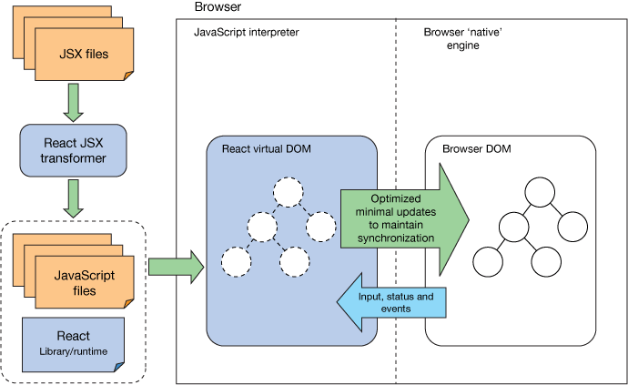

_[<< Back to main page](https://maggievu.github.io/learning-reactjs/)_

## Framework Overview

### What is React JS?
The reason I chose to learn React JS is because it's a flexible open-source JavaScript library for building beautiful user interfaces. It's also powerful, efficient, lightweight and fast rendering to increase higher web performance.

<hr>

### Components
Let's take a closer look at React JS.

In simpler words, React JS takes up a webpage and splits into elements (same as HTML elements) and allows developers to write or build these elements using JavaScript. These elements and components are reusable to be called as necessary throughout the webpage. This is an important feature which makes React so powerful.

Basically, React JS uses HTML syntax and at the same time, incorporates JavaScript logic (such as functions, classes, events) to display the elements onto the webpage.

Elements are the smallest building blocks of React and they usually represent DOM tags in an HTML document.  
Elements are what components are “made of”, these 2 concepts are not exactly the same thing, but let’s not worry too much about them right now.


_<sub>Source: [Edureka - Slideshare](https://www.slideshare.net/EdurekaIN/react-components-lifecycle-react-tutorial-for-beginners-reactjs-training-edureka)</sub>_

Components are like functions in JavaScript logic. They take in "props" (which means parameters, arguments) and render outputs to be displayed on screen.  
Components can also be defined using the class concept in JavaScript. The reason for this is because components can change and to keep track of updates we use the concept of "state".


_<sub>Source: [React JS Tutorial - Codevoila](https://www.codevoila.com/post/57/reactjs-tutorial-react-component-lifecycle)</sub>_

A React component can be any of the following three statuses: mounted, update and unmounted.  
As you can see, mounting is the initial state when the component is first inserted into the DOM. Updating is when the component’s props have been modified and unmounting is when the component has been removed completely from the DOM.

For a more detailed lifecycle methods, check out [this visually interactive diagram](http://projects.wojtekmaj.pl/react-lifecycle-methods-diagram/).

<hr>

### React Virtual DOM

I have mentioned a lot about the DOM (or the HTML document), let’s make this clear. React JS does not operate directly on the browser’s DOM.  
It has its own virtual DOM to operate on. This is different from the browser’s DOM.


_<sub>Source: [React Intro - IBM](https://www.ibm.com/developerworks/library/wa-react-intro/index.html)</sub>_

What happens is that React components are first rendered into a virtual DOM built and run entirely in memory. The virtual DOM performs an optimized diffing against the browser's DOM (by comparing the newly update virtual DOM with a pre-update "snapshot" version of the same virtual DOM) and then will intelligently decides the minimal/necessary updates to the browser’s DOM.

In other words, for every DOM object, there is a corresponding "virtual DOM object" which is a representation of a real DOM object with the same properties. [CodeCademy](https://www.codecademy.com/articles/react-virtual-dom) put it this way, manipulating the virtual DOM is like editing a blueprint, where as manipulating the real DOM is like moving rooms in an actual house.


### JSX (JavaScript eXtension)

React also allows developers to write easy structures using its special syntax called JSX. This is a syntax extension that lets us declare elements in a manner that closely resembles HTML. Simply put, developers can use JSX to write JavaScript that looks like HTML.

```js
// This is React written with JSX syntax
class HelloWorld extends React.Component {
    render() {
        return (
            <h1 className="header">Hello World</h1>
        );
    }
}
```

```js
// This is React written without JSX syntax
class HelloWorld extends React.Component {
    render() {
        return (
            React.createElement(
                'h1',
                {className: 'header'},
                'Hello World'
            )
        );
    }
}
```

```html
<!-- Both methods give the same output  -->
<h1 class="header">Hello World</h1>
```

<hr>

### Why React again?

React JS is just a library, not its own framework. That's why it will save you lots of time and effort trying to understand and figure out the patterns and architecture of the MVC (Model-View-Controller) behind. You can just simply focus on improving the front-end development and providing great user interfaces.

If you want to become an app and mobile developer, React JS will be your best friend. Since it also comes with React Native, you can build native apps on Android and iOs platforms, using the same methodology, architecture and thinking process. And if you want to dig deeper, there is also the Flux architecture which marries really well with React. But that is for another rainy day!
