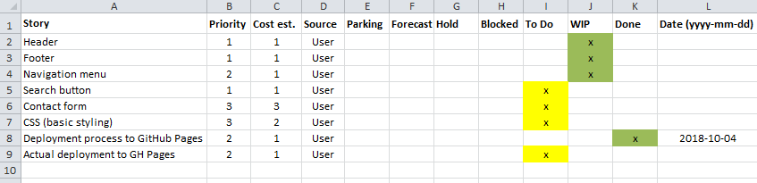

_[<< Back to main page](https://maggievu.github.io/learning-reactjs/)_

## 75% Progress Report

### Retrospective of this week

- Figure out how to deploy React project using create-react-app npm package
- Bulletin board app (prototype version, no css, editing and saving abilities only) uploaded [here](https://maggievu.github.io/reactjs-app-test/)
- Have wireframes from design team
- Measure of velocity: TBD
- Impediments: still unsure about component's states and lifecycle.

### Plan for next week

- Finish CodeCademy course
- Review event handlers to help overcome impediments
- Complete the prototype
- Prepare for 2nd presentation

### Product backlog

_Ctrl/Cmmd+Click to open the image in a new tab or Ctrl/Cmmd+Click [here](https://drive.google.com/open?id=1lkfEjoJkVE3SSWVqgBLF6-CPAedMHePk) to open the excel file_

_[<< previous post](week-09-24)_

_[next post >>](week-10-08)_
