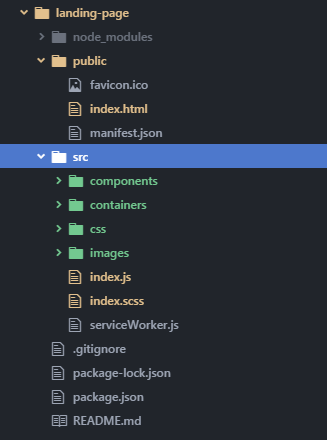
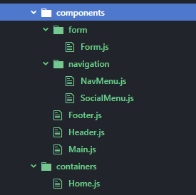
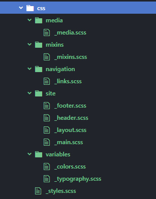

_[<< Back to main page](https://maggievu.github.io/learning-reactjs/)_

## Prototype Demo - Retrospective - Project Plan

The prototype is live [here](https://maggievu.github.io/react-landing-page/). Source files are located [here](https://github.com/maggievu/learning-reactjs/tree/master/prototype/landing-page/src).

### Technical Demos

If you are interested, [here's my presentation](https://docs.google.com/presentation/d/1zIaucZiD32w8hReMMoo0jZwI5Wt7Capf-R4hXktfj9k/edit?usp=sharing) for the demos.

Organizing your files into sub-folders and folders is super important, especially when you start learning a new language.

Here is what I did, or attempted to do, in order to have a better structure of my files.







Below is my first reusable component. ```NavMenu``` renders a ```<nav>``` to be used in both ```<header>``` and ```<footer>```.
*React asks for ```<li>``` to include the ```key``` property in order to keep track of all the list items.*

```js
class NavMenu extends Component {
  render() {
    // const pages = ['home', 'causes', 'effects', 'solutions', 'about', 'contact'];
    let pages = [];
    this.props.className === "header-nav"
      ? (pages = ["causes", "effects", "solutions", "about", "contact"])
      : (pages = ["home", "causes", "effects", "solutions", "about", "contact"]);

    const navLinks = pages.map((page, i) => {
      return (
        <li key={i}>
          <a href={"#" + page}>{page}</a>
        </li>
      );
    });

    return (
      <nav className={this.props.className}>
        <ul>{navLinks}</ul>
      </nav>
    );
  }
}
```

And here is my ```Form``` component. Although very much tempted by the convenience and efficiency of all other form libraries out there (aka. *Formik*), I decided to go with React along with states and event handlers to better my understanding of the latter.

The initial state of ```sentSuccess``` is set to ```false``` so that ```render()``` will display the traditional form at the beginning. Then whenever the form is submitted, ```handleSubmit()``` will change ```sentSuccess``` to ```true``` so that ```render()``` will return ```renderSuccess()``` which in turn, will display the successful message along with a recap of your form.

```js
class Form extends Component {
    constructor(props) {
        super(props);
        this.state = {
            userName: "",
            userEmail: "",
            userSubject: "",
            userMessage: "",
            userSubscribe: false,
            sentSuccess: false
        };

        this.handleChange = this.handleChange.bind(this);
        this.handleSubmit = this.handleSubmit.bind(this);
        this.renderForm = this.renderForm.bind(this);
        this.renderSuccess = this.renderSuccess.bind(this);
    }

    handleChange(e) {
        const stateName = e.target.name;
        const stateValue = e.target.type === "checkbox" ? e.target.checked : e.target.value;
        this.setState({
            [stateName]: stateValue
        });
    }

    handleSubmit(e) {
        e.preventDefault();
        this.setState({
            sentSuccess: true
        });
    }

    renderForm() {
        return (
            <form className="contact-form" onSubmit={this.handleSubmit}>
                <label>
                    <span>Name: </span>
                    <input
                        type="text"
                        name="userName"
                        value={this.state.userName}
                        onChange={this.handleChange}
                    />
                </label>
                <label>
                    <span>Email: </span>
                    <input
                        type="email"
                        name="userEmail"
                        value={this.state.userEmail}
                        onChange={this.handleChange}
                    />
                </label>
                <label>
                    <span>Subject: </span>
                    <input
                        type="text"
                        name="userSubject"
                        value={this.state.userSubject}
                        onChange={this.handleChange}
                    />
                </label>
                <label>
                    <span style={{verticalAlign: 'top', marginTop: '.5rem'}}>Message: </span>
                    <textarea
                        name="userMessage"
                        value={this.state.userMessage}
                        onChange={this.handleChange}
                    />
                </label>
                <label>
                    <input
                        type="checkbox"
                        name="userSubscribe"
                        checked={this.state.userSubscribe}
                        onChange={this.handleChange}
                    />
                    Susbcribe to our newsletters!
                </label>
                <input type="submit" value="Send" />
            </form>
        );
    }

    renderSuccess() {
        return (
            <div className="contact-success">
                <p>Thank you for contacting us. We will get back to you within 5 days.</p>
                <div className="contact-success-results">
                    <p><strong>Your message</strong></p>
                    <p>Name: <em>{this.state.userName}</em></p>
                    <p>Email: <em>{this.state.userEmail}</em></p>
                    <p>Subject: <em>{this.state.userSubject}</em></p>
                    <p>Message: <em>{this.state.userMessage}</em></p>
                    <p>
                        I <em>{this.state.userSubscribe ? " want " : " do not want "}</em> to susbcribe to GlobalStats newsletters.
                    </p>
                </div>
            </div>
        );
    }

    render() {
        return this.state.sentSuccess ? this.renderSuccess() : this.renderForm();
    }
}
```

React JS does provide an [extensive chapter on forms](https://reactjs.org/docs/forms.html) because it reflects best React states as the “single source of truth”, a term that you might see frequently deeper into the process. Anyway, React JS is truly dynamic and interactive that it will change the way you think about how DOM elements are built.

<hr>

### Retrospective

- Although I'm quite happy with my ```Form``` component, I still think it can be broken down to smaller components. I remember reading somewhere that components should only do one thing, either display/render something (*presentational components*) or process something like fetching data (*container components*). This is helpful for re-usability purpose. I will take that in mind for my group project.

- One thing I did not include in this prototype is ```react-router```. Since what I wanted to build is a single-page landing page so it was not necessary... yet. So much more to learn!!!

- Another thing that I haven't gotten a chance to look into is lifecycles, along with ```ComponentDidMount```, ```ComponentDidUnmount``` and ```ComponentDidUpdate```. There're also other similar methods with ```Will``` instead of ```Did```. Go figure!

- One other thing to mention is that I might have spent too much time on styling instead of focusing on improving the functionality, but I can't help it, I love experimenting with my CSS knowledge.

<hr>

### Project Plan

Quick reminder about our group project:
- Topic: Data visualization about growing environmental issues
- MVP focus: Global climate change

Here are possible plans to include React JS in our web app project (*need validation*):

- Build the entire web app using React JS
- Create an **interactive** visualization using React JS and FusionCharts
- Build a blog for users (ability to login, write and post comments)
- Integrate Flux framework into the project???


_<sub>[<< previous post](week-10-01)</sub>_

_<sub>next post >>[](week-10-15)</sub>_
