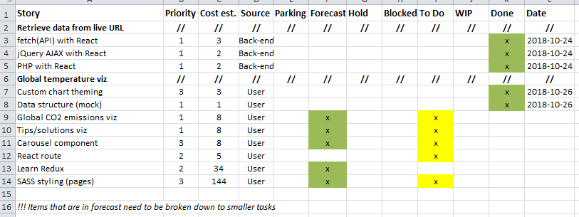

_[<< Back to main page](https://maggievu.github.io/learning-reactjs/)_

## 20% Progress Report

### Retrospective of last week

- This week I looked into how to render the visualiztions using data fetched from a live URL (or API). It turned out to be more complicated and tedious than I thought it would be because everything is done within the scope of create-react-app npm. By trying to render the charts with data retrieved from live URL (links from NASA [here](https://climate.nasa.gov/system/internal_resources/details/original/647_Global_Temperature_Data_File.txt) and [here](ftp://aftp.cmdl.noaa.gov/products/trends/co2/co2_mm_mlo.txt)), I finally understand why PHP is not recommended along with ReactJS. Also, one thing that React can do is fetching from a live JSON API and render the data (but the API has to be under JSON format) using ```fetch``` command with ```componentDidMount()``` method.

- That's why I could not deliver the promise I made last week that I would be studying Redux. The project is more important and data visualization is the main focus. But I will definitely start on the Redux courses next week since we had some progress with data fetching using NodeJS and ReactJS.

- Measure of velocity: 11

- Impediments: NodeJS seems to be the only way to retrieve data with React apps so I will also need to look into it (to support our lead developer who will be mainly in charge of fetching data). Another impediment is that I still haven't had a clear idea of how to properly integrate Redux into our project. I know that I can always use Redux to manage the charts' states but I really want to challenge myself and strive for the best I can do.

### Plan for next week

- Finish 2 Redux courses
    - [Redux Tutorial - Dan Abramov by Egghead](https://egghead.io/series/getting-started-with-redux)
    - [Redux Tutorial - LearnCode Academy by YouTube](https://www.youtube.com/watch?v=1iAG6h9ff5s&list=PLoYCgNOIyGABj2GQSlDRjgvXtqfDxKm5b&index=6)
- Refine charts for UX and brand theming

### Product backlog

[](https://maggievu.github.io/learning-reactjs/assets/images/week-10-22/project-20.png)

_<sub>Ctrl/Cmmd+Click to open the image in a new tab or Ctrl/Cmmd+Click [here](https://drive.google.com/open?id=1NE6O1MdDwHMJwsXGKgXqIKVURE8BUQXu) to open the excel file</sub>_

_<sub>[<< previous post](week-10-15)</sub>_

_<sub>next post >>[](week-10-29)</sub>_
