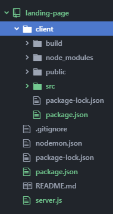
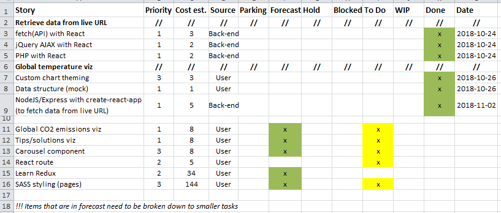

_[<< Back to main page](https://maggievu.github.io/learning-reactjs/)_

## 40% Progress Report

### Retrospective of this week

- This week I finally was able to fetch data from URL using NodeJS and Express implemented with create-react-app npm. So what happened is every files within the scope of create-react-app needed to be moved to a ```client``` folder. Then in the root folder I ended up with having only ```server.js```, the new ```package.json``` (a different one), ```nodemon.json``` and the ```client``` folder mentioned above.

    

- The newly created file ```package.json``` will tell npm to launch the React app and run the server (both front-end and back-end) concurrently at the same time.

    ```json
    /* package.json */
    {
        "dependencies": {
            "body-parser": "^1.18.3",
            "express": "^4.16.4",
            "gh-pages": "^2.0.1"
    },
        "devDependencies": {
            "concurrently": "^4.0.1"
        },
        "scripts": {
            "client": "cd client && npm start",
            "server": "nodemon server.js",
            "dev": "concurrently --kill-others-on-fail \"npm run server\" \"npm run client\"",
            "start": "nodemon server.js",
            "deploy": "cd client && npm run deploy"
        }
    }
    ```

- What's left for me to do is to edit ```server.js``` to go to the live url ([link here](https://climate.nasa.gov/system/internal_resources/details/original/647_Global_Temperature_Data_File.txt)), retrieve that txt data, convert it to ```json``` format and write to a ```json``` file so that the ```FusionChart``` can read that ```json``` file and use it as data source. Sounds easy!

- However when I actually did it, issues pop up, like usual. Somehow NodeJS kept running and restarting in a loop and it broke my internet connection. Then I was able to figure out that because it kept fetching data and the ```json``` file kept being rewritten in a way (although it was the same data), that's why I needed ```nodemon.js``` (since I'm using ```nodemon``` not ```node```) to tell NodeJS to watch only these specifics files. Issue solved!!!

    ```json
    /* nodemon.js */
    {
        "watch": [
            "server.js",
            "public"
        ]
    }
    ```

- This is my ```server.js``` file. Very simple, straightforward and self-explanatory process. Obviously it needs some refining like checking the URL to see if it's updated and then rewriting the ```json``` file or if it's not then leave ```json``` file as is.

    ```js
    const express = require('express');
    const app = express();
    const port = process.env.PORT || 5000;

    // Console.log the port Listening at
    app.listen(port, () => console.log(`Listening on port ${port}`));

    const url = "https://climate.nasa.gov/system/internal_resources/details/original/647_Global_Temperature_Data_File.txt";
    const fs = require('fs');
    const request = require('request');

    let dataArray1 = [];
    let dataArray2 = [];

    request.get(url, (error, res, body) => {
        if (!error && res.statusCode == 200) {

            // loop through the lines of body of txt file then push elements of lines to dataArray
            for (let line of body.split("\n")) {
                dataArray1.push({
                    "x": line.split("\t")[0],
                    "y": line.split("\t")[1]
                });
                dataArray2.push({
                    "x": line.split("\t")[0],
                    "y": line.split("\t")[2].replace("\r", "")
                });
            }

            // create 2 new JSON files so that react charts can use
            fs.writeFile('client/src/components/charts/ZoomScatter/dataSource/dataset1.json', JSON.stringify(dataArray1), 'utf8');
            fs.writeFile('client/src/components/charts/ZoomScatter/dataSource/dataset2.json', JSON.stringify(dataArray2), 'utf8');
        }
    });
    ```

- Measure of velocity: 15 (since the week is not over and weekend means weekday, I'm intending to finish the 2 redux courses by Monday next week). My product backlog will obviously look a little bit different then.

### Plan for next week

- Work on the ```react-route``` to create different pages for the web app.
- Build all the rest of the components for the corresponding pages.

### Product backlog

[](https://maggievu.github.io/learning-reactjs/assets/images/week-10-29/project-40.png)

_<sub>Ctrl/Cmmd+Click to open the image in a new tab or Ctrl/Cmmd+Click [here](https://drive.google.com/open?id=18PGWuh6UoTUE69R7_MoA-4jQ9zRPGQdT) to open the excel file</sub>_

_<sub>[<< previous post](week-10-22)</sub>_

_<sub>[next post >>(week-11-05)</sub>_
