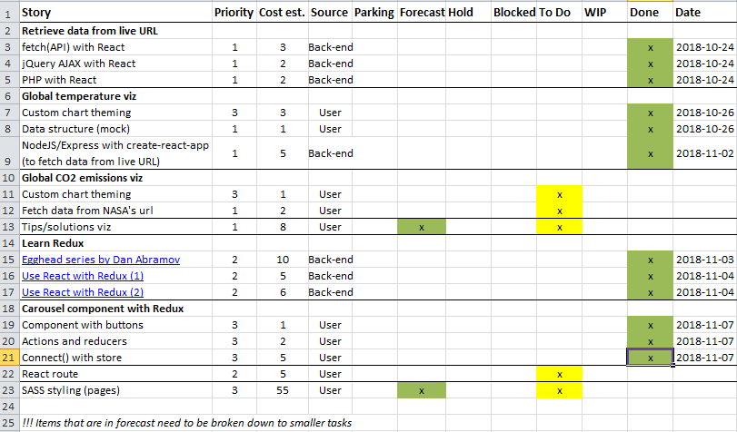

_[<< Back to main page](https://maggievu.github.io/learning-reactjs/)_

## 60% Progress Report - Retrospective

### Retrospective of this week

- This week, I can finally proudly say that I know Redux and most importantly, I understand how and why React and Redux work so well together. [Redux documentation](https://redux.js.org/introduction/learningresources) proposes wonderful learning resources in case [its introduction](https://redux.js.org/introduction/threeprinciples) is not clear or helpful enough.

- Here's the [link](https://drive.google.com/open?id=1KcarHfP5608QEefk6AwGb1bJyAeL3N0fMUmUG1rjHHA) for my presentation for the WIP demo. Here's the [link](https://maggievu.github.io/climateguide) for the actual WIP demo. And here's the [link](https://github.com/maggievu/climateguide/tree/master) for the source files.

- Understanding Redux definitely changes my view of traditional webpages and how elements (or components) interact with each others. This newfound belief opens up a whole new world of possibilities and things I can't even imagine building before. However, I do have to mention that Redux is not necessarily appropriate or helpful for every React apps. Dan Abramov himself [talked about this](https://medium.com/@dan_abramov/you-might-not-need-redux-be46360cf367) too. And in the scope of our group project, Redux might not be helpful at all. Our web app is just simply not that complexed and React's local state is doing a fine job so far.

- Having said that, I decided it'd be good for me to actually implement Redux in some small part of the project. And the carousel that switches between sections came to mind. There are 3 sections in total: causes, effects and solutions. The carousel also includes 5 buttons, but let's just focus on the ```next``` and ```previous``` buttons for the sake of simplicity. My Section component looks like this.

    ```js
    class Section extends Component {
        render() {
            return (
                <section className={'section section-' + this.props.id}>
                    <h2 className='section-title'>{this.props.id}</h2>
                    <div className="img-container">
                        <div className="img-description">
                            <h3>{this.props.contentH3}</h3>
                            <p>{this.props.content}</p>
                        </div>
                        
                    </div>
                    <button id='first' onClick={this.props.first}></button>
                    <button id='second' onClick={this.props.second}></button>
                    <button id='third' onClick={this.props.third}></button>
                    <button id='prev' onClick={this.props.onPrev}><span className='fas fa-chevron-left'></span></button>
                    <button id='next' onClick={this.props.onNext}><span className='fas fa-chevron-right'></span></button>
                </section>
            );
        }
    }
    ```

- All the props will retrieve information from my array of states, which is stored in my ```storeState.json```. The only thing to identify between the states is the ```index``` key which is also the position of the state in my array.

    ```json
    // storeState.json

    [
        {
            "index": 0,
            "id": "causes",
            "contentH3": "Air Pollution",
            "content": "One line explaining the cause. Another line makes a meaningful connection to the dislayed image. The last line presents what will happen in the future/long term.",
            "imgSrc": "/air-pollution.jpg"
        },
        {
            "index": 1,
            "id": "effects",
            "contentH3": "Deforestation",
            "content": "One line explaining the effect. Another line makes a meaningful connection to the dislayed image. The last line presents what will happen in the future/long term.",
            "imgSrc": "/deforestation.jpg"
        },
        {
            "index": 2,
            "id": "solutions",
            "contentH3": "Cooling Tower",
            "content": "One line explaining the solution. Another line makes a meaningful connection to the dislayed image. The last line presents what will happen in the future/long term.",
            "imgSrc": "/cooling-tower.jpg"
        }
    ]    
    ```

- Next step is to create all the actions, aka events linked to the buttons. Actions in Redux are required to be a Javascript object that must have ```type``` as one of the keys. You can also pass in other arguments but let's just create simple actions for now.

    ```js
    // actions/index.js

    export const first = () => ({
        type: "FIRST"
    });

    export const second = () => ({
        type: "SECOND"
    });

    export const third = () => ({
        type: "THIRD"
    });

    export const prevSection = () => ({
        type: "PREV"
    });

    export const nextSection = () => ({
        type: "NEXT"
    });
    ```

- Now the fun part begins! Reducers will be triggered whenever an action is dispatched. They are used to tie the actions and the states together. They are pure functions, which enforces one of React's rules: *states are immutable*. They take in the current state and the action, then in turn return a new state. In the case of the ```previous``` button, the reducer will check if the ```index``` key is 0, then returns the previous state in the array or go the last state. Same logic for the ```next``` button.

    ```js
    // reducers/index.js

    import storeState from '../components/main/storeState.json';

    const reducer =  (state = storeState[0], action) => {
        switch (action.type) {
            case "FIRST":
                return storeState[0];
            case "SECOND":
                return storeState[1];
            case "THIRD":
                return storeState[2];
            case "PREV":
                return state.index !== 0 ? storeState[state.index - 1] : storeState[2];
            case "NEXT":
                return state.index !== 2 ? storeState[state.index + 1] : storeState[0];
            default:
                return state;
        }
    };

    export default reducer;
    ```

- Now all is left to do is to connect the state and the actions with our Component props with the ```connect()``` function. Here I used ```mapStateToProps``` and ```mapDispatchToProps``` which are built-in functions that literally map all the props to the current state and dispatches.

    ```js
    // Section.js

    import React, {Component} from 'react';
    import {connect} from 'react-redux';
    import {first} from '../../actions';
    import {second} from '../../actions';
    import {third} from '../../actions';
    import {prevSection} from '../../actions';
    import {nextSection} from '../../actions';

    class Section extends Component {} // mentioned above

    const mapStateToProps = state => ({
        id: state.id,
        contentH3: state.contentH3,
        content: state.content,
        imgSrc: process.env.PUBLIC_URL + state.imgSrc
    });

    const mapDispatchToProps = dispatch => ({
        first: () => dispatch(first()),
        second: () => dispatch(second()),
        third: () => dispatch(third()),
        onPrev: () => dispatch(prevSection()),
        onNext: () => dispatch(nextSection())
    });

    export default connect(mapStateToProps, mapDispatchToProps)(Section);
    ```

- Last but not least, we have to create a store and actually integrating Redux with React to tell them to talk together. And now my app is live with React and Redux!

    ```js
    // Carousel.js

    import React, {Component} from 'react';
    import Section from './Section';

    import {createStore} from 'redux';
    import {Provider} from 'react-redux';
    import reducer from '../../reducers';

    const store = createStore(reducer);
    console.log(store.getState());

    class Carousel extends Component {
        render() {
            return (
                <Provider store={store}>
                    <div className="carousel">
                        <Section />
                    </div>
                </Provider>
            );
        }
    }

    export default Carousel;
    ```

- Measure of velocity: 18.

### Plan for next week

- Start with ```react-router``` to implement different pages for our project.
- Finish all the visualizations (the important ones) such as CO2 emissions, paper tips...

### Product backlog

[](https://maggievu.github.io/learning-reactjs/assets/images/week-11-05/project-60.png)

_<sub>Ctrl/Cmmd+Click to open the image in a new tab or Ctrl/Cmmd+Click [here](https://drive.google.com/open?id=1zUaVUXpm6U5mUD-SQ5NBkoyDb8Ea_7E2) to open the excel file</sub>_


_<sub>[<< previous post](week-10-29)</sub>_

_<sub>next post >>[](week-11-12)</sub>_
