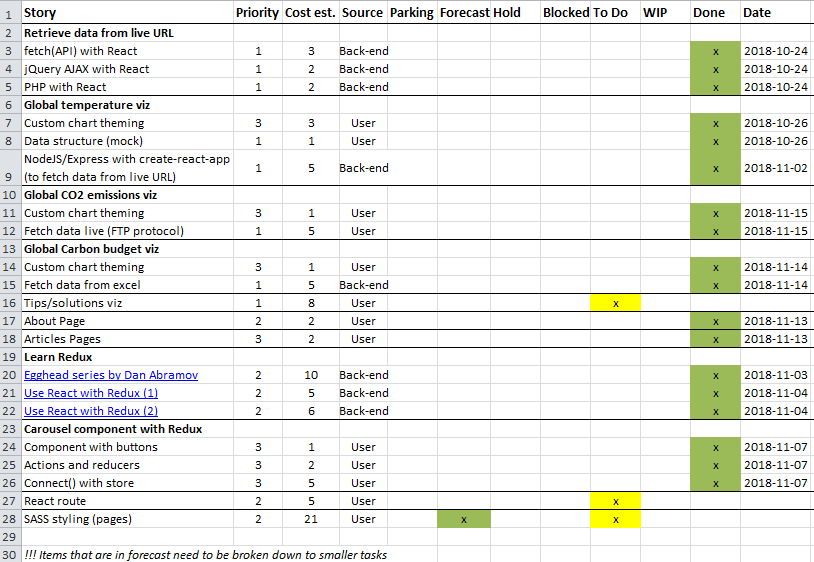

_[<< Back to main page](https://maggievu.github.io/learning-reactjs/)_

## 80% Progress Report

### Retrospective of this week

- This week I was able to create 2 more charts for "Causes & Effects" page. The 1st chart is "Global Carbon Budget" fetched from a local excel file and the 2nd is "Global CO2 emissions" fetched from a live URL with  FTP protocol (different from HTTP protocol).

- I didn't realize it would take me more time than I expected since FTP uses a different fetching protocol than HTTP (didn't know about this before hand).

- Anyway, I succeeded nonetheless to fetch data live from [NASA URL](ftp://aftp.cmdl.noaa.gov/products/trends/co2/co2_annmean_mlo.txt).

    ```js
    const ftp = require('ftp');

    let client = new ftp();
    client.on('ready', () => {
        client.get('products/trends/co2/co2_annmean_mlo.txt', (error, stream) => {
            if (error) throw error;

            stream.once('close', () => {
                client.end();
            });

            let content = "";
            stream.on('data', (chunk) => {
                content += chunk;
            });
            stream.on('end', () => {
                dataArray3 = content.split('\n');
                for (let line = 57; line < dataArray3.length-1; line++) {
                    dataArray4.push({
                        "x": dataArray3[line].trim().split("   ")[0],
                        "y": dataArray3[line].trim().split("   ")[1]
                    });
                }
                fs.writeFile('../client/src/components/causes/co2Chart/dataSource/dataset.json', JSON.stringify(dataArray4), 'utf8', (error) => {
                    if (error) throw error;
                });
            });
        });
    });

    client.connect({
        host: "aftp.cmdl.noaa.gov"
    });    
    ```

- As for "Global Carbon Budget", since I wasn't able to find any available and easy-to-fetch-from API, I decided to use the local excel file that I found a while back. Along with that, I used ```excel-to-json``` npm package to convert the data to a JSON format file.

    ```js
    const excelToJson = require('convert-excel-to-json');
    let sourcePath = '../client/src/components/causes/carbonChart/dataSource';

    // Fossil Fuel - column B
    dataArray2.push(excelToJson({
        sourceFile: sourcePath + '/carbon.xlsx',
        sheets: [{
            name: 'Global Carbon Budget',
            range: 'A42:F78',
            columnToKey: {
                A: 'x',
                B: 'y'
            }
        }]
    }));

    // Atmospheric Growth - column D
    dataArray2.push(excelToJson({
        sourceFile: sourcePath + '/carbon.xlsx',
        sheets: [{
            name: 'Global Carbon Budget',
            range: 'A42:F78',
            columnToKey: {
                A: 'x',
                D: 'y'
            }
        }]
    }));

    // Land-use Change Emissions - column C
    dataArray2.push(excelToJson({
        sourceFile: sourcePath + '/carbon.xlsx',
        sheets: [{
            name: 'Global Carbon Budget',
            range: 'A42:F78',
            columnToKey: {
                A: 'x',
                C: 'y'
            }
        }]
    }));

    // Land Sink - column E
    dataArray2.push(excelToJson({
        sourceFile: sourcePath + '/carbon.xlsx',
        sheets: [{
            name: 'Global Carbon Budget',
            range: 'A42:F78',
            columnToKey: {
                A: 'x',
                E: 'y'
            }
        }]
    }));

    // Ocean Sink - column F
    dataArray2.push(excelToJson({
        sourceFile: sourcePath + '/carbon.xlsx',
        sheets: [{
            name: 'Global Carbon Budget',
            range: 'A42:F78',
            columnToKey: {
                A: 'x',
                F: 'y'
            }
        }]
    }));

    fs.writeFile(sourcePath + '/dataset.json', JSON.stringify(dataArray2), 'utf8', (error) => {
        if (error) throw error;
    });
    ```

- And now both of my Fusioncharts have the properly-structured-formatted data to render on screen. Another thing I did was create the "About" page and 4 "Articles" pages. My "About" page simply uses the reusable "Member" component and pass down different data for different members. One missing piece of data is our pictures ```props.memberImg``` but that ca be added later.

    ```js
    // "Member" component

    import React, { Component } from 'react';

    class Member extends Component {
        render() {
            return (
                <section className='about-member'>
                    
                    <h3>{this.props.memberName}</h3>
                    <p>{this.props.memberRole}</p>
                    <p>{this.props.memberDesc}</p>
                </section>
            );
        }
    }

    export default Member;
    ```

    ```js
    // "About" component

    import React, { Component } from 'react';
    import Member from './Member';

    class About extends Component {
        render() {
            return (
                <div>
                <Member memberName="Harmanpreet Kaur"
                        memberImg
                        memberRole="Lead front-end developer / Back-end support"
                        memberDesc="Harman is a highly-motivated, results-driven and insightful Computer Science graduate. She likes to solve real-world problems using technology, such as building reliable applications and making it accessible to the large audiences." />

                <Member memberName="Meet Madhu"
                        memberImg
                        memberRole="Lead quality assurance analyst / Front-end support"
                        memberDesc="As a Computer Engineering graduate, Meet is an experienced JAVA developer and junior web developer. He is very hardworking and passionate about what he does, that’s why he’ll be in charge of ensuring functional and design specifications of the web app." />

                <Member memberName="Diego Rodrigues de Oliveira"
                        memberImg
                        memberRole="Lead back-end developer / UX UI support"
                        memberDesc="Diego has a Bachelor of Graphic Design and over 5 years of professional experience in e-commerce and responsive web design. He is excited about taking on new roles and new challenges for this project, as he will be in charge of the dataset and server, along with its structures and processing algorithms." />

                <Member memberName="Yulia Stanovsky"
                        memberImg
                        memberRole="Lead UX UI / Designer / Animator"
                        memberDesc="With a Bachelor degree of fine arts and animation, Yulia enjoys creating beautiful and practical design solutions in her projects. She carries her sketch book and color pencils all the time so that she’s always ready to create great UX and UI design along with the animation (via user interaction) of our web app." />

                <Member memberName="Mai Khanh (Maggie) Vu"
                        memberImg
                        memberRole="Project manager / Development & QA support"
                        memberDesc="Having a Master degree in Information and Communications Technology, Maggie has a solid background in the ICT economy and regulation. Her experience working in different industries and cultures allows her to empower her team members and leverage the collective strengths. She will ensure that the project is complete on time within scope." />

                </div>
            );
        }
    }

    export default About;
    ```

- __Measure of velocity:__ 16.

### Plan for next week

- Finish building the visualizations on the landing page.
- Using ```react-router``` to route to pages and articles from within the carousel.
- Help the other front-end developer with styling.

### Product backlog

[](https://maggievu.github.io/learning-reactjs/assets/images/week-11-12/project-80.png)

_<sub>Ctrl/Cmmd+Click to open the image in a new tab or Ctrl/Cmmd+Click [here](https://drive.google.com/open?id=14c1GX7ecQxa_b0AJ4DXJrN9nraKpNMa3) to open the excel file</sub>_


_<sub>[<< previous post](week-11-05)</sub>_

_<sub>next post >>[](week-11-19)</sub>_
