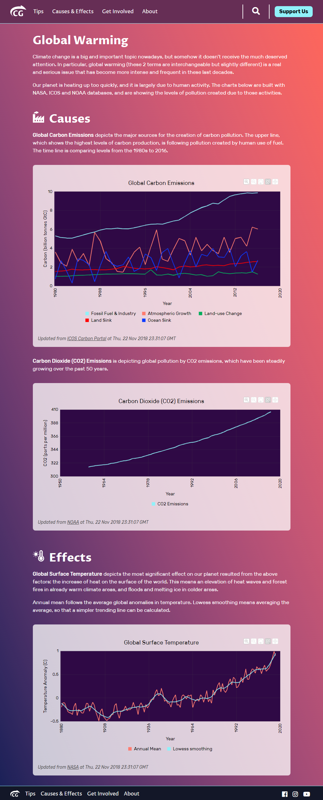
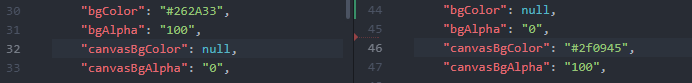
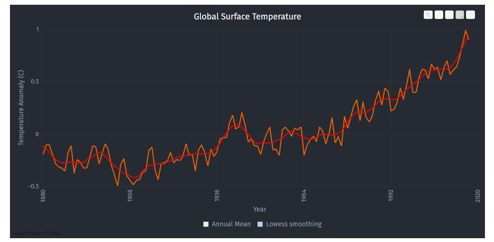
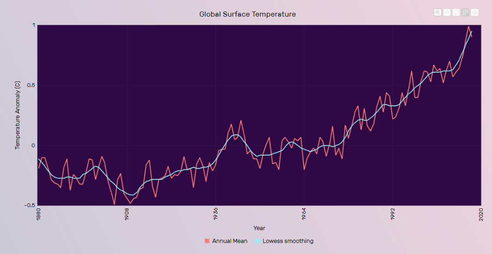
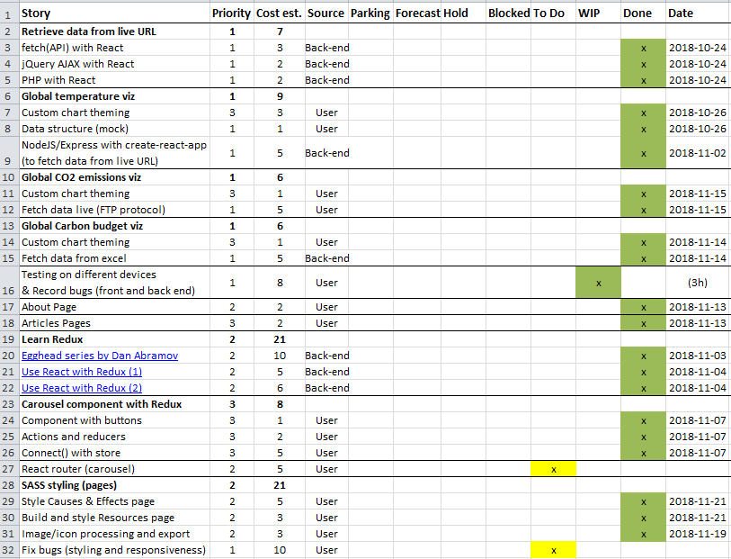

_[<< Back to main page](https://maggievu.github.io/learning-reactjs/)_

## 90% Progress Report

### Retrospective of this week

- This week, I finally got around to check with our designer about the pages and their respective mockups. It turned out that a lot of components need to be "retouched" to match with our brand identity. I was mostly in charge with styling the "Causes & Effects" page since I was already involved with 3 FusionCharts from the beginning. Since this blog is about React, I won't be boring you with my "CSS skill", I'll just show you the end product right away.

    

- If you haven't noticed, the difference of the charts from before is that their entire background should be transparent to match the creamy box behind whereas the "canvas" will actually have the purple color. In order to achieve that effect, you need to change these properties in the ```chart``` object:

    

    You'll also need to add one extra line in your respective CSS file to get rid of the default white background of FusionChart (```svg``` is the wrapping tag).

    ```css
    svg {
        background-color: transparent !important;
    }
    ```

    That took me a little while to figure out and I almost gave up but wanting to fulfill the designer's wish, I told myself not to. Alas, this is the result.

    

    


- I was also able to test the project on tablets (iPad) and mobiles (iPhone). After launching ```npm start``` on your computer, your browser will automatically display ```localhost:3000```. The trick is to grab your computer "local IP" then add ":3000", you'll have the address to see your own project on mobile and touchscreen devices (as long as all are on the same WiFi network). So what happened is that every time I made a change, the browsers on my computer, my iPad and my iPhone will automatically re-render to reflect that new change. It's super convenient if you're doing either responsiveness or testing for readability, color, contrast and other visual-related issues.

- One other thing I was able to finish is building the ```Resources``` component. Since React component is reusable, this is how I did, and it's pretty much self-explanatory for you React lovers.

    ```js
    // Resources.js
    import React, { Component } from 'react';
    import resources from './resources.json';

    class Resources extends Component {
        render() {
            const links = resources.map((resource, i) => {
                return (
                  <li key={i}>
                      <a href={resource.url}>
                          {resource.name}
                      </a>
                  </li>
                );
            });

            return (
                <div>
                    <h2>Resources</h2>
                    <ul>{links}</ul>
                </div>
            );
        }
    }

    export default Resources;
    ```

    ```json
    // resources.json
    [
        {
            "name": "NASA Data",
            "url": "https://data.nasa.gov/"
        },
        {
            "name": "NASA APIs",
            "url": "https://api.nasa.gov/"
        },
        {
            "name": "NASA Climate Change",
            "url": "https://climate.nasa.gov/"
        },
        {
            "name": "Earth Now app by NASA",
            "url": "https://itunes.apple.com/us/app/earth-now/id494633346?mt=8"
        },
        {
            "name": "NOAA",
            "url": "https://www.noaa.gov/"
        },
        {
            "name": "ICOS Carbon Portal",
            "url": "https://www.icos-cp.eu/"
        },
        {
            "name": "Climate Change website - by the Government of Canada",
            "url": "https://www.canada.ca/en/services/environment/weather/climatechange.html"
        },
        {
            "name": "Climate Change website - by the National Geographic",
            "url": "https://www.nationalgeographic.com/environment/climate-change/"
        },
        {
            "name": "Statista",
            "url": "https://www.statista.com/topics/1148/global-climate-change/ "
        },
        {
            "name": "ProgrammableWeb APIs",
            "url": "https://www.programmableweb.com/category/climate/api"
        },
        {
            "name": "The World Bank - Renewable Energy",
            "url": "http://ppi-re.worldbank.org/data"
        },
        {
            "name": "Aeris Weather",
            "url": "https://www.aerisweather.com/develop/"
        },
        {
            "name": "DataBC",
            "url": "https://catalogue.data.gov.bc.ca/dataset?sector=Natural+Resources&download_audience=Public"
        }
    ]
    ```

- What went well: styling and reusing React components.

- What didn't: having to go back to FusionCharts documentation.

- What was interesting: FusionCharts offers a lot of flexibility in terms of personalizing charts, but at the same time very limited if weren't covered in the documentation. For example, I wasn't able to change how the controls in the top right corner look and behave.

- What I'd do differently: making sure the designer provided all the specifications and requirements before starting coding and styling.

- __Measure of velocity:__ 14.

### Plan for next week

- ```react-router```: I know I've been delaying this for too long already but something always came up and 7 days seem too short for a week.
- More testing and fixing!!!
- Prepare for the presentation (for both WMDD4992 and final stage pitch presentation)

### Product backlog

[](https://maggievu.github.io/learning-reactjs/assets/images/week-11-19/project-90.png)

_<sub>Ctrl/Cmmd+Click to open the image in a new tab or Ctrl/Cmmd+Click [here](https://drive.google.com/open?id=19EaTayGjgLJt0y18wFQS8QMxzAbbF3hk) to open the excel file</sub>_

__Note:__ I changed "Tips/Solutions viz" to "Testing & Recording bugs" on line 16 since another developer was able to handle it and QA is often ignored and/or underestimated but its nonetheless super-important!


_<sub>[<< previous post](week-11-12)</sub>_

_<sub>next post >>[](week-11-26)</sub>_
