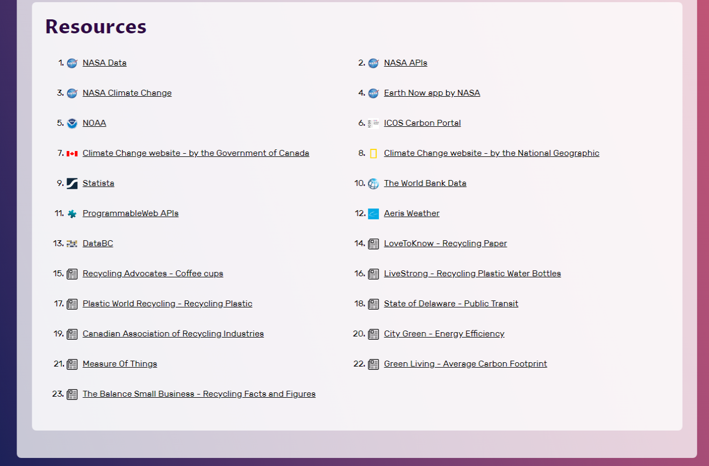
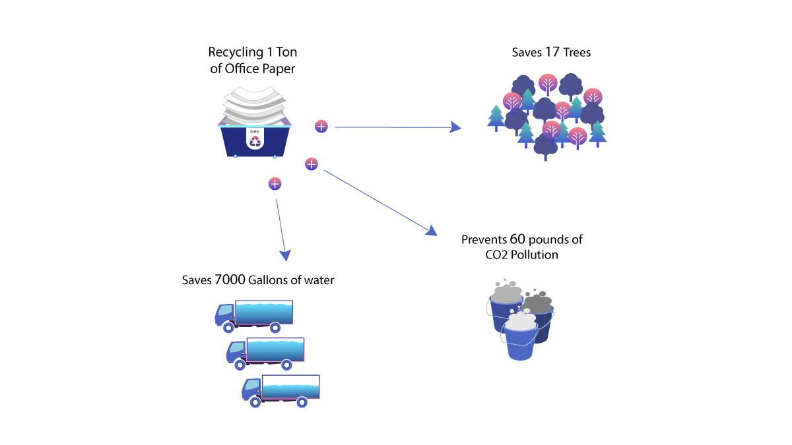
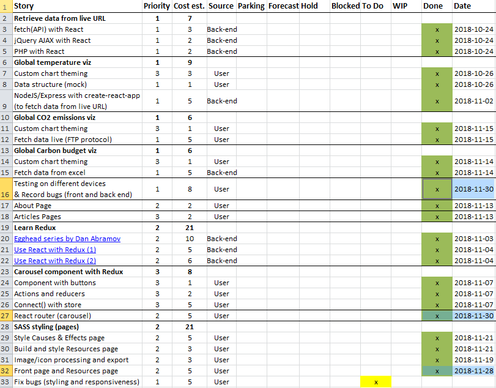

_[<< Back to main page](https://maggievu.github.io/learning-reactjs/)_

## 95% Progress Report

### Retrospective of this week

- Being this far into the journey, I thought I had known and seen every great thing about React. But somehow I still found myself amazed and astounded by what React is capable of.

- If you remember last week, I built a ```Resources``` component. Our designer suggested that we also include the logos of the famous organizations next to their names. Now all of the resources' names and URLs are stored in a separate JSON file. And the only way I know how to put an image into React is by importing. But since that JSON formatted file will not accept any other syntax than [] or {} or key-value pair, I need to find another way to import images into the app. And here comes ```require```. This one line actually took me a little while to figure out:

    ```js
    
    ```

- The trick is ```require``` only accepts a string as a valid argument for path. So only store your file name in the JSON file, not the entire path itself. For example, this ```require(filename.svg)``` won't work. But this ```require("../" + filename.svg)``` will work. Like I said, I'm continually blown away by the magic of React. This is the end result on [Climate Guide live](http://climateguide.tech/about):

    

- Another thing I was able to do is build an interactive component for all the paper, plastic, electricity and transit facts on the front page. This is a reusable component where its parent will only need to pass down the images' sources as props.

    

    The idea is when users click on the "+" button, another SVG will reveal and the button changes to "-". Users can toggle the button back and forth and the SVG will behave accordingly. At first, I was thinking about dynamically appending elements onto the DOM, but then I'd also have to think about removing said elements. But that would complicate everything. I ended up using opacity as the solution. When the button is clicked, it will change the corresponding SVG's opacity to 1 (initial value is 0) and vice versa. Such simple and effective! Now all that's left to do is styling and animating.

    ```js
    import React, {Component} from 'react';
    import plus from '../assets/icons/plus.svg';
    import minus from '../assets/icons/minus.svg';

    class Interactive extends Component {
        constructor(props) {
            super(props);

            this.state = {
                first: [0, plus],
                second: [0, plus],
                third: [0, plus]
            };

            this.first = this.first.bind(this);
            this.second = this.second.bind(this);
            this.third = this.third.bind(this);
        }

        first() {
            this.setState({
                first: [this.state.first[0] === 0 ? 1 : 0, this.state.first[1] === plus ? minus : plus]
            });
        }

        second() {
            this.setState({
                second: [this.state.second[0] === 0 ? 1 : 0, this.state.second[1] === plus ? minus : plus]
            });
        }

        third() {
            this.setState({
                third: [this.state.third[0] === 0 ? 1 : 0, this.state.third[1] === plus ? minus : plus]
            });
        }

        render() {
            return (
               <div className={"viz " + this.props.className}>
                   

                   <button onClick={this.first} className="viz_btn first">
                        
                   </button>

                   <button onClick={this.second}>
                        
                   </button>

                   <button onClick={this.third}>
                        
                   </button>

                   
                   
                   
               </div>
               );
           }
       }

       export default Interactive;
    ```

- What went well: reusing React components and routing to pages with ```react-route```

- What didn't: having to find the right logos (PNGs with transparent background - no JPG, no JPEG, no white background)

- What was interesting: finding another way to import images into React.

- What I'd do differently: not much, since this is all a great learning experience for me. Project-wise, maybe no more project managing next time...

- __Measure of velocity:__ 15 (3h out of 8h for testing has been accounted last week).

### Plan for next week

- Finish the slides for final stage presentation. You can take a look [here](https://slides.com/maggievu/climateguide/).
    <iframe src="//slides.com/maggievu/climateguide/embed" width="576" height="420" scrolling="no" frameborder="0" webkitallowfullscreen mozallowfullscreen allowfullscreen></iframe>
<p></p>

- Keep testing and fixing so that the project is ready for the audience to try out.

### Product backlog

[](https://maggievu.github.io/learning-reactjs/assets/images/week-11-26/project-95.png)

_<sub>Ctrl/Cmmd+Click to open the image in a new tab or Ctrl/Cmmd+Click [here](https://drive.google.com/open?id=1UqVxv-_tcCPCLWfPdkwNCtPNyowQdERi) to open the excel file</sub>_


_<sub>[<< previous post](week-11-19)</sub>_

_<sub>next post >>[](week-12-03)</sub>_
