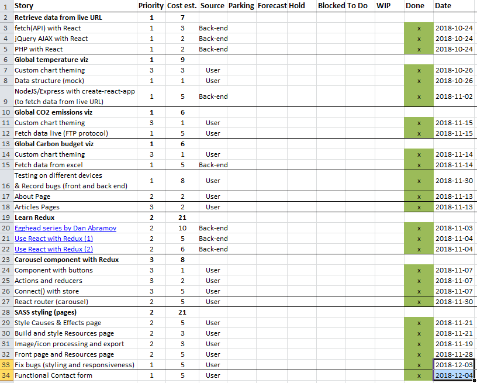

_[<< Back to main page](https://maggievu.github.io/learning-reactjs/)_

## Final check-in - Retrospective

### Executive summary

- Like every other Agile projects I have done during the course of this program, there are always last minute's decisions and alterations. And for the case of our project Climate Guide, it's the contact form that I have done way back when I first started learning React.

- The contact form, so far, has only been presentational. Now that our web app is fully deployed (our lead dev [Harman](https://github.com/harmanparihar/) has been working so hard deploying the production build instead of the development build of a `create-react-app` project), people might actually visit the site and try to connect with us. I also want to add that we had the opportunity to present the project (twice, nonetheless) to industry experts and made some amazing connections.

- There wasn't any back-end processing so that we would receive the messages from user's input. And since this was all done with React, I had no idea how or where to begin. The only way I knew is to use [https://formspree.io/](https://formspree.io/), a third party service for contact forms sending from static HTML pages; or WordPress plugins, but again, they had nothing to do with a back-end structure.

- And as usual, Google came to the rescue. It turned out that `webpack` had a `nodemailer` package that was specifically built for that. I just needed to have a Mailgun account so that all the messages would be routed to their platform and only those with a valid email will then be sent to my personal inbox. Everything is pretty straight forward, you only need to pay attention to the back-end path to be defined `/api/form` and the `sendMail()` method. Basically, this method will actually send the email to the `transporter` that we defined (host, email and password) and send back to the front-end (client side) a simple message of 'fail' or 'success'.

    ```js
    // SEND FORM SUBMISSION TO EMAIL (crm/index.js)

    const nodemailer = require('nodemailer');

    app.post('/api/form', (req, res) => {
        nodemailer.createTestAccount((err, account) => {
            const htmlEmail = `
            <div>
            <p>Name: ${req.body.userName}</p>
            <p>Email: ${req.body.userEmail}</p>
            <p>Subject: ${req.body.userSubject}</p>
            <p>Message: ${req.body.userMessage}</p>
            <p>Joined the discussion board: ${req.body.userSubscribe}</p>
            </div>
            `;

            let transporter = nodemailer.createTransport({
                host: 'smtp.mailgun.org',
                port: 587,
                auth: {
                    user: "postmaster@sandbox3d5d1673a19941b6bad15f59c7585e15.mailgun.org",
                    pass: "123456aS"
                }
            });

            let mailOptions = {
                from: req.body.userEmail,
                to: 'maggievu91@gmail.com',
                replyTo: req.body.userEmail,
                subject: req.body.userSubject,
                text: req.body.userMessage,
                html: htmlEmail
            }

            transporter.sendMail(mailOptions, (error, success) => {
                if (err) {
                    console.log('ERROR: ' + error);
                    res.json({
                        message: 'fail'
                    });
                } else {
                    console.log('SUCCESS: ' + JSON.stringify(success));
                    res.json({
                        message: 'success'
                    });
                }
            });
        })
    });
    ```

- Now back to the front-end contact form using React, [everything stays exactly the same](https://maggievu.github.io/learning-reactjs/posts/week-10-08) except for the `handleSubmit()` event handler. First of all, the backend path that I defined in Node should use `localhost:PORT` if you're in your own local development environment or the live site address if it's already deployed. In my case, I piggybacked on what our backend dev already defined and just imported it to my form component. And here I used `axios` to fetch and send data between the front and back (`fetch` is also an alternative if you prefer to stay with React and not installing any extra module). My form component will receive whatever the backend sent as I mentioned above. If 'success' it updates my `state.sent` to `true` and thus, renders the successful notification, whereas 'fail' will simply alert users to try again. Secondly, I also added a little tweak of a spinner when the user hits send (instead of the successful notification being immediately rendered) by defining `state.sending` as `false` initially, changing to `true` when `handleSubmit()` is triggered, and changing back to `false` when the message has been sent.

    ```js
    async handleSubmit(e) {
        e.preventDefault();
        this.setState({
            sending: true
        });

        await axios.post(path + '/api/form', this.state)
        .then(res => {
            if (res.data.message === 'success') {
                this.setState({
                    sending: false,
                    sent: true
                });
            } else {
                alert("Something's not right... Would you like to try again?");
            }

        })
        .catch(err => {
            console.log('ERROR on front-end ' + err);
        });
    }
    ```

- My `button` will also look a little bit different.

    ```js
    <button type="submit">
        {this.state.sending ? <span><span class="fas fa-spinner fa-spin"></span> Sending</span> : "Send message"}
    </button>
    ```

- Feel free to [send us tips, feedback or simply an invite to connect and have coffee](http://climateguide.tech/about)!

### Retrospective of this week

- What went well: fetching and sending data between server and client side.

- What didn't: having to look into all the backend paths and ports.

- What was interesting: having more insights about how cool animations were made with no crazy JavaScript or library.

- What I'd do differently: getting a crash course on general full stack concepts and basics next time.

- __Measure of velocity:__ 10.

### Retrospective of the journey

- Overall, almost at the finish line of this 12-week journey, I realized how much I have learnt and grown and at the same time, found out things about myself that I didn't know I was capable of before. What went so well was React's dynamic and flexible abilities. What was even more interesting was how beautifully React fit in together nicely with Node and Redux. And everything is purely JavaScript-based, how amazing is that! Obviously, there were some challenges and difficulties, but that's what team is for. And together, we hit every balls out of the park!

- Special thank you to our wonderful mentors: [Tyler Higgs](https://www.linkedin.com/in/tylerhiggs/), [Paul Brassard](https://www.linkedin.com/in/paulbrassard/), [Jeremy Hilliker](https://ca.linkedin.com/in/jeremy-hilliker-79bb9413) and [Stephen Chiong](https://ca.linkedin.com/in/stephen-chiong-0124178a). This is not good bye, as I will be back and keep continually developing this awesome blog :)

### Product backlog

[](https://maggievu.github.io/learning-reactjs/assets/images/week-12-03/project-100.png)

_<sub>Ctrl/Cmmd+Click to open the image in a new tab or Ctrl/Cmmd+Click [here](https://drive.google.com/open?id=1tIJDBY_Tgn4SCMupa9bdn8JZmisHbd6a) to open the excel file</sub>_


_<sub>[<< previous post](week-11-26)</sub>_
